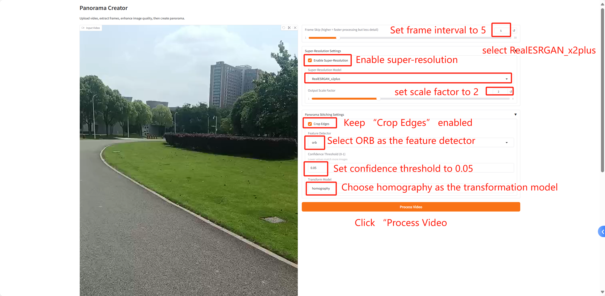
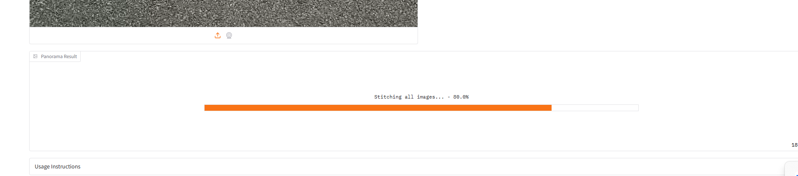

# Panorama Creator – User Interface Guide

This document provides an overview of the user interface, operating instructions, and main feature workflow of the Panorama Creator application.

## Main Program Components

The application consists of three main components:

1. app.py - User interface and main entry point
2. frame_processor.py - Video frame extraction and super-resolution processing
3. panorama_stitcher.py - Panorama stitching functionality

## Running the Application

To start the application:

**The linux system is more stable because this project is developed based on the linux system**
**For linux**
Users may need to using pip install with Linux-requirement.txt

**For windows**
Users may need to using pip install with windows-requirement.txt

```bash
python app.py
```

Once launched, the terminal will display a local access URL (usually http://127.0.0.1:7860). Open this address in your browser to use the application.


## About Model Weights

This application uses locally stored Real-ESRGAN model weights. All model weights should be placed in the weights folder under the main program directory. The application does not download weights automatically, so they must be prepared in advance.

Supported model weight files include:
- RealESRGAN_x4plus.pth
- RealESRGAN_x4plus_anime_6B.pth
- RealESRGAN_x2plus.pth
- RealESRNet_x4plus.pth
- realesr-animevideov3.pth
- realesr-general-x4v3.pth

## User Interface Overview

The interface is built using the Gradio library and consists of the following sections:

### 1. Title and Description

The top of the interface displays the title "Panorama Creator" along with brief usage instructions.

### 2. Video Upload Section

The left section allows users to upload a video. For best results, use videos shot with horizontal or vertical panning.

### 3. Parameter Controls

The right section provides various parameter settings:

#### Basic Parameters
- Frame Interval Slider: Controls the frequency of frame extraction (1–30). Higher values speed up processing but reduce detail.

#### Super-Resolution Settings (Collapsible Panel)
- Enable Super-Resolution: Checkbox to toggle super-resolution enhancement for frames.
- Model Selection: Dropdown to choose the super-resolution model.
- Output Scale Factor: Slider to adjust the upscaling factor (1–4).

#### Panorama Stitching Settings (Collapsible Panel)
- Crop Edges:  Checkbox to determine whether to crop irregular edges of the final panorama.
- Feature Detector: Dropdown to select the feature detection algorithm (SIFT or ORB).
- Transformation Model: Dropdown to choose the geometric transformation type (homography or affine).
### 4. Process Button

A "Process Video" button initiates the full processing workflow.

### 5. Result Display Area

Displays the generated panorama result upon completion.

### 6.  Help Panel (Collapsible)

Provides detailed usage instructions, workflow, and important notes.

## Workflow

1. Upload a Video: Use the video input section to upload your file.
2. Adjust Parameters:
   - Increase the frame interval for longer videos to speed up processing.
   - Choose an appropriate super-resolution model based on your video content.
   - Select suitable feature detector and transformation model depending on the scene.


3. Start Processing: Click the "Process Video" button.
4. Monitor Progress: Status updates and progress bars will indicate processing stages.
5. View & Save Result: The final panorama will be shown in the output area for download.

## Detailed Processing Logic

When the "Process Video" button is clicked, the system follows these steps:

1. Input Validation
   - Checks if a video file was provided.
   - If not, returns an empty result.

2. Temporary Workspace Creation
   - Generates a unique identifier and creates a temporary directory (e.g., process_XXXXXXXX).
   - Adds this path to a global TEMP_DIRS list for later cleanup.

3. Frame Extraction (via frame_processor.py)
   - Shows 0% progress and “Preparing video processing…” message.
   - Sets parameters (frame interval, SR toggle, model name, scale factor).
   - Calls frame_processor.process_video:
     a. Creates a frames subfolder.
     b. Opens the video and retrieves metadata (total frames, FPS, duration).
     c. Extracts frames based on interval, saves as JPEGs.
     d. Updates progress (~30%).

4. Super-Resolution Processing (if enabled)
     a. Creates enhanced subfolder for SR-processed frames.
     b. Loads the selected SR model from the weights folder.
     c. Applies super-resolution to each frame, saves results.
     d. Updates progress (~40%).
   - If successful, use enhanced frames; otherwise, fall back to raw frames.

5. Panorama Stitching (via panorama_stitcher.py)
   - Updates progress to 70%, shows “Stitching panorama…”
   - Sets stitching parameters:
     a. Crop option.
     b. Confidence threshold.
     c. Feature detector (SIFT/ORB).
     d. Transformation model (homography/affine).
   - Calls panorama_stitcher.create_panorama:
     a. Reads all extracted frames.
     b. Creates a Stitcher or AffineStitcher object.
     c. Performs stitching: feature matching, matrix estimation, blending.
     d. Updates progress (~30%).
     e. Saves result as panorama.jpg in the workspace.

6. Result Handling
   - Shows 100% progress and “Processing complete!”

   - Check whether the panorama was successfully created.
   - If successful, copies the panorama image to a persistent temp file.
   - Returns the file path for UI display and download.

7. Resource Cleanup
   - Registers an exit-time cleanup function to delete all temporary folders.

Throughout the process, the UI provides real-time feedback via progress bars and messages. Upon completion, the panorama is shown and can be saved.

## Example Operation

A typical workflow example:

1. Upload a horizontally panned landscape video.
2. Set frame interval to 5.
3. Enable super-resolution, select RealESRGAN_x2plus, set scale factor to 2.
4. Keep “Crop Edges” enabled.
5. Select ORB as the feature detector.
6. Set confidence threshold to 0.05.
7. Choose homography as the transformation model.
8. Click “Process Video.”
9. Wait for processing and download the result.


## File Structure
```bash
|-- Panorama                                    # Transferred files
|-- app.py                                      # Main entry point, which also serves as the UI interface
|-- frame_processor.py                          # Encapsulation of step1.py logic, including frame extraction and super-resolution
|-- panorama_stitcher.py                        # Wrapper for step2.py, containing image stitching logic
|-- readme.md                                   # Main documentation
|-- requirements.txt                            # Dependencies (works on Ubuntu)
`-- weights                                     # Super-resolution models
    |-- RealESRGAN_x2plus.pth
    |-- RealESRGAN_x2plus.pth:Zone.Identifier
    |-- RealESRGAN_x4plus.pth
    |-- RealESRGAN_x4plus.pth:Zone.Identifier
    |-- RealESRGAN_x4plus_anime_6B.pth
    |-- RealESRGAN_x4plus_anime_6B.pth:Zone.Identifier
    |-- RealESRNet_x4plus.pth
    |-- RealESRNet_x4plus.pth:Zone.Identifier
    |-- realesr-animevideov3.pth
    |-- realesr-animevideov3.pth:Zone.Identifier
    |-- realesr-general-wdn-x4v3.pth
    |-- realesr-general-wdn-x4v3.pth:Zone.Identifier
    |-- realesr-general-x4v3.pth
    `-- realesr-general-x4v3.pth:Zone.Identifier
```